<h1 align="center">Kofeecheks</h1>

<p align="center">
  
</p>

<p align="center">
  
  
  
  
</p>

---

## About me

-  I build and modify **Space Station 14** related projects
-  I work with **C#**, **TypeScript** and **JavaScript**
-  I like tools, experiments, game-related development and community projects.
-  I enjoy making things look clean, useful and a little bit sci-fi

---

## Featured projects

-  [Space-Station-14-Midi-for-Dead-Space](https://github.com/Kofeecheks/Space-Station-14-Midi-for-Dead-Space)
-  [sector-frontier-14](https://github.com/Kofeecheks/sector-frontier-14)
-  [Speakly](https://github.com/Kofeecheks/Speakly)
-  [gradient-back](https://github.com/Kofeecheks/gradient-back)
-  [dead-space-14](https://github.com/Kofeecheks/dead-space-14)

---

## GitHub stats

<p align="center">
  
  
</p>

---

## Tech stack

<p align="center">
  
</p>

---

## Contacts

<p align="center">
  <a href="https://github.com/Kofeecheks">
    
  </a>
  <a href="https://t.me/your_username">
    
  </a>
  <a href="https://discord.com/users/your_id">
    
  </a>
</p>

---

<details>
  <summary><b>More about me</b></summary>
  <br>

```text
Current focus:
- SS14 forks and builds
- tooling and experiments
- clean code and better UI
