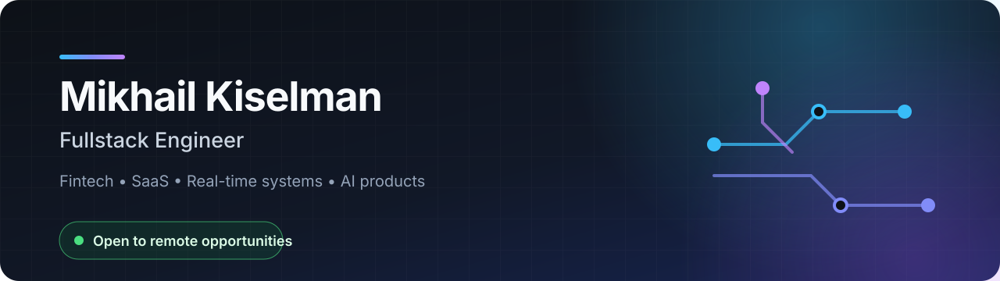

  

  
  
  

## I build production systems end to end

I'm a **Fullstack Engineer with 4+ years of commercial experience** building integration-heavy web products. I work across backend architecture, frontend applications, data, infrastructure, security, and delivery — from the first schema and API contract to production monitoring.

My strongest areas are **fintech and payments, SaaS platforms, real-time systems, third-party integrations, and AI-enabled products**.

- Design APIs, services, background jobs, queues, and integration boundaries
- Build customer-facing products and internal operational tools
- Own authentication, billing, webhooks, failure recovery, and observability
- Ship through Docker-based environments, CI/CD, tests, code review, and smoke checks

> Most of my production work is private. The case studies below intentionally describe the engineering scope without exposing client, company, product, or repository names.

## Selected production experience

| Domain | Engineering scope |
| --- | --- |
| **Fintech & payments** | Core API and gateway services, seven operational web panels, payment order lifecycle, provider routing, callbacks and webhooks, JWT access zones, background workers, deep-link/card/SBP flows, rate limiting, SSRF protection, allowlists, metrics, logs, smoke tests, and recovery automation. |
| **Commerce platforms** | Multilingual Next.js storefronts, carts and checkout flows, admin tooling, PostgreSQL-backed services, Shopify Storefront and Customer Account integrations, transactional email, and messaging integrations. |
| **Compute infrastructure** | GPU rental workflows with external provider integrations, per-minute billing, job orchestration, PostgreSQL, Redis, Celery, and customer/admin interfaces. |
| **AI media products** | Music and voice SaaS platforms with authentication, credits, subscriptions, payments, email flows, third-party model APIs, and containerized deployment. |

## Core stack

  
  
  
  
  
  
  
  
  
  
  
  
  
  

| Layer | Tools and practices |
| --- | --- |
| **Frontend** | TypeScript, React, Next.js, Vue.js, Tailwind CSS, state management, SSR, accessible responsive UI |
| **Backend** | PHP 8 / Symfony, Node.js / NestJS, Python / FastAPI, REST, WebSocket, queues, workers, integrations |
| **Data** | PostgreSQL, Redis, Prisma, EF Core, migrations, transactions, indexing |
| **Delivery** | Docker, GitHub Actions, CI/CD, Vercel, Linux, structured logging, metrics, health checks |
| **Quality & security** | Playwright, unit/e2e tests, code review, JWT, rate limiting, allowlists, SSRF-safe integrations |

## Selected public work

| Project | What it demonstrates | Stack |
| --- | --- | --- |
| [**gradient-back**](https://github.com/Kofeecheks/gradient-back) · [live demo](https://gradient-back.vercel.app/) | Interactive WebGL gradient with custom shader animation and pointer-driven effects | React, React Three Fiber, GLSL, Vite |
| [**space-station-14-soyuz**](https://github.com/Kofeecheks/space-station-14-soyuz) | Work with a large open-source multiplayer codebase, content systems, builds, and community development | C#, .NET, ECS |
| [**Labs**](https://github.com/Kofeecheks/Labs) | Desktop and data-layer engineering with documented setup and tests | C#, WPF, WinForms, EF Core, SQL Server, Docker |

## How I work

- **Own the vertical slice.** Data model, API, UI, integration, release, and monitoring belong to one coherent solution.
- **Design for failure.** Timeouts, retries, idempotency, auditability, recovery paths, and useful logs are part of the feature.
- **Keep boundaries explicit.** Clear contracts and isolated adapters make payment providers and external APIs replaceable.
- **Use AI with engineering discipline.** AI tools accelerate research and implementation; tests, review, and production evidence decide what ships.

## Let's build something reliable

I'm open to **remote Fullstack, Backend, and Product Engineer roles** where I can own meaningful systems and ship measurable product value.

  
  

